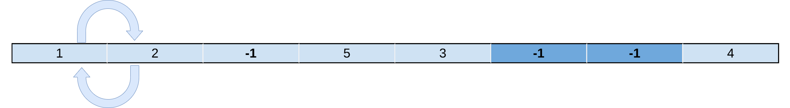
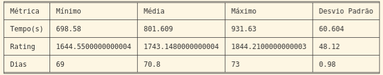

# Descrição

Este trabalho implementa um Algoritmo Genético em cima de filmes que ganharam o prêmio do Oscar. A ideia é assistir a todos os filmes na menor quantidade de dias possíveis, com algumas restrições, que são elas: não se pode assistir mais que 240 minutos por dia; e o filme Poderoso Chefão I deve ser assistido antes do Podersoso Chefão II.

# Identificação

- Matheus José da Costa &emsp;11711BCC008
- Rafael Valentim Silva &emsp;&emsp;11711BCC010

# Representação do Cromossomo

O Cromossomo será representado como uma configuração da ordem em que os filmes deverão ser assistidos com um delimitador específico que determina a divisão entre os dias. Cada gene representa um índice que define qual o filme que deverá ser assistido. Um gene especial, representado por -1, um índice inválido, representa a quebra de dias. Abaixo é representado graficamente um cromossomo:

Devido a representação escolhida para o cromossomo, seu tamanho será 185, considerando que a configuração máxima é dada por um único filme sendo assistido por dia, como são 93 filmes, a configuração seguiria o padrão [x, -1, x, -1, x, -1, ..., x] resultando em 93 genes representando filmes e 92 representando separadores. Essa representação também requer que o critério de avaliação seja  restringido por uma condição que, se dois índices inválidos aparecem em sequência, tal solução é inválida caso todos filmes não foram visitados, caso contrário é uma solução aceita.

# Função Objetivo

A função objetivo do Algoritmo Evolutivo é a soma da multiplicação dos ratings diários dos filmes assistidos  e deve ser maximizada. Ela deveria sim tratar soluções inválidas, como dias sem assistir nenhum filme, configurações em que a soma da duração dos filmes assistidos em um só dia ultrapassar 240 minutos e, particularmente, quando o filme O Poderoso Chefão II for visto antes de O Poderoso Chefão I, contudo essas verificações serão feitas previamente na decodificação do cromossomo.

# Decodificação do Cromossomo

Dada a representação descrita no tópico anterior, a decodificação do cromossomo é bem simples e baseado em 2 critérios aplicados a cada gene:

 1. Se o gene possui um número inteiro maior que -1 ele equivale a um índice de um filme armazenado em uma lista
 2. Se o valor do gene é -1 é tratado como uma divisão de dias

Aplicando tais condições, cada cromossomo é convertido em uma lista de tuplas de filmes, que representa a configuração final dos filmes que devem ser assistidos a cada dia.

Existem cenários em que a representação esperada não é garantida, como no exemplo abaixo. Nele, dois -1, que representam a quebra entre dias, são apresentados em seguida sem que todos os filmes tenham sido assistidos. Esse é um cenário de erro tratável e todos os genes, em sequência, que apresentarem -1 serão descartados até que um índice válido seja encontrado, no cenário de exemplo o gene com número 4, ou que o cromossomo acabe.

As restrições de duração máxima por dia (240 minutos) e quando o filme O Poderoso Chefão II for visto antes de O Poderoso Chefão I também serão tratadas. A primeira não é tratável e a função objetivo não poderá ser aplicada, a segunda será tratada invertendo os dias em que os dois filmes aparecem, e, caso apareçam no mesmo dia, sua ordem de exibição será invertida.

# Operadores de Recombinação e Mutação

## Mutação

### Deslocamento

Essa foi a abordagem escolhida, e basicamente escolhemos algum filme e trocamos ele de lugar e ajustamos os índices do cromossomo.

## Recombinação
Para a geração das recombinações foi usada o operador de _Order Crossover_ (OX1). Para a seleção dos progenitores foi utilizado o método da roleta, onde a probabilidade de um cromossomo ser selecionado aumenta proporcionalmente de acordo com sua aptidão.
### Order Crossover (OX1)
Devido a natureza de ordenação do problema, foi usada um operador de recombinação que mantém a ordem e não gera repetições. O operador OX1 faz com que parte de um progenitor seja mapeada para uma porção do outro progenitor, preenchendo as posições remanescentes com os genes restantes de cada progenitor, omitindo o que já foram contemplados e garantindo a ordem.

# Estrutura do Algoritmo Genético

# Operador Elitismo

Foi utilizado esse operador pois para a geração dos filhos os pais mais adaptados tinham maior probabilidade em serem escolhidos.

# Experimentos

## Geração da população

### Random

Primeiro foi criado uma função para gerar a população de maneira randômica, sem um padrão da separação de dias e o delimitador (-1).
Notou-se que essa abordagem não era tão efetiva por conta da desordem. 

### Com padrão

Essa foi a abordagem escolhida para gerar a população porque ela coloca um delimitador (-1) nas posições ímpares do cromossomo, e nas posições pares os filmes.
Dessa forma conseguimos ter um maior controle nas operações que fazemos dentre desse cromossomo, principalmente nas mutações.

## Mutação Inversa

O primeiro teste usando-se mutação foi com a Inversa, que pode ser vista na seguinte imagem:

Essa abordagem não foi eficiente pois havia muitos casos em que trocava-se um delimitador de lugar com algum filme, e isso fazia com que num mesmo dia tivesse mais que dois filmes assistidos.

## Recombinação usando a técnica de 1 ponto
Um teste utilizando o operador de recombinação de 1 ponto também foi aplicado no projeto. O funcionamento de tal operador se dá em torno de sortear uma posição dentro do tamanho do cromossomo e depois inverter as primeiras posições antes do número sorteado do primeiro progenitor com as mesmas posições do segundo progenitor.

O uso do perador de recombinação de 1 ponto não foi eficiente, uma vez que causa repetição e viola o contexto gerado pelos genes.

## Estatísticas

Como estatística, o programa foi executado por 15 vezes seguidas, e coletados alguns dados para serem trabalhados, e são eles:

  1. Tempo
  2. Rating
  3. Dias

Com essas informações, foi calculado o valor Mínimo, a Média, o Valor Máximo e o Desvio Padrão em cima de cada uma dessas métricas. Como segue:

Observa-se que houve melhoras em cada iteração do algoritmo, e isso acontece por conta da forma como foi inicialmente gerada a população, pelas mutações e cross overs.

Caso queira observar com mais detalhes, há um arquivo localizado na pasta logs com as 15 execuções, e seus respectivos resultados finais.

# Referências
- https://sites.icmc.usp.br/andre/research/genetic/
- https://pessoal.dainf.ct.utfpr.edu.br/tacla/IA/016a-AlgGeneticos.pdf