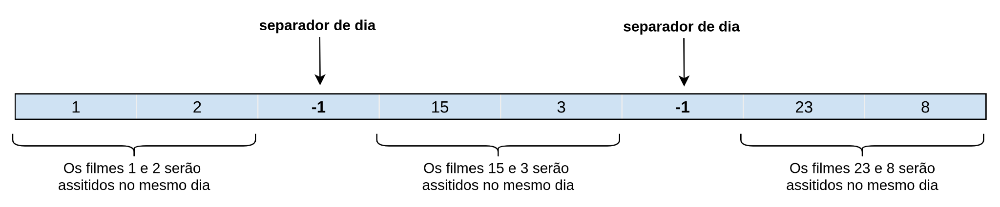
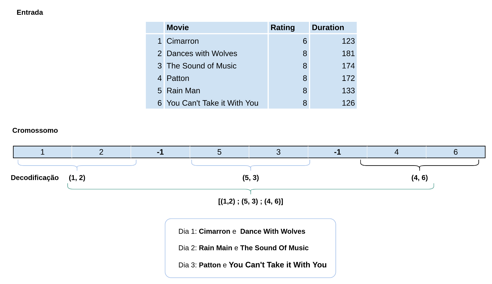
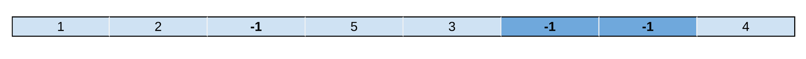

# Descrição

Este trabalho implementa um Algoritmo Genético em cima de filmes que ganharam o prêmio do Oscar. A ideia é assistir a todos os filmes na menor quantidade de dias possíveis, com algumas restrições, que são elas: não se pode assistir mais que 240 minutos por dia; e o filme Poderoso Chefão I deve ser assistido antes do Podersoso Chefão II.

# Identificação

- Matheus José da Costa &emsp;11711BCC008
- Rafael Valentim Silva &emsp;&emsp;11711BCC010

# Representação do Cromossomo

O Cromossomo será representado como uma configuração da ordem em que os filmes deverão ser assistidos com um delimitador específico que determina a divisão entre os dias. Cada gene representa um índice que define qual o filme que deverá ser assistido. Um gene especial, representado por -1, um índice inválido, representa a quebra de dias. Abaixo é representado graficamente um cromossomo:

Devido a representação escolhida para o cromossomo, seu tamanho será 185, considerando que a configuração máxima é dada por um único filme sendo assistido por dia, como são 93 filmes, a configuração seguiria o padrão [x, -1, x, -1, x, -1, ..., x] resultando em 93 genes representando filmes e 92 representando separadores. Essa representação também requer que o critério de avaliação seja  restringido por uma condição que, se dois índices inválidos aparecem em sequência, tal solução é inválida caso todos filmes não foram visitados, caso contrário é uma solução aceita.

# Função Objetivo

A função objetivo do Algoritmo Evolutivo é a soma da multiplicação dos ratings diários dos filmes assistidos  e deve ser maximizada. Ela deveria sim tratar soluções inválidas, como dias sem assistir nenhum filme, configurações em que a soma da duração dos filmes assistidos em um só dia ultrapassar 240 minutos e, particularmente, quando o filme O Poderoso Chefão II for visto antes de O Poderoso Chefão I, contudo essas verificações serão feitas previamente na decodificação do cromossomo.

# Decodificação do Cromossomo

Dada a representação descrita no tópico anterior, a decodificação do cromossomo é bem simples e baseado em 2 critérios aplicados a cada gene:
    1. Se o gene possui um número inteiro maior que -1 ele equivale a um índice de um filme armazenado em uma lista
    2. Se o valor do gene é -1 é tratado como uma divisão de dias

Aplicando tais condições, cada cromossomo é convertido em uma lista de tuplas de filmes, que representa a configuração final dos filmes que devem ser assistidos a cada dia.

Existem cenários em que a representação esperada não é garantida, como no exemplo abaixo. Nele, dois -1, que representam a quebra entre dias, são apresentados em seguida sem que todos os filmes tenham sido assistidos. Esse é um cenário de erro tratável e todos os genes, em sequência, que apresentarem -1 serão descartados até que um índice válido seja encontrado, no cenário de exemplo o gene com número 4, ou que o cromossomo acabe.

As restrições de duração máxima por dia (240 minutos) e quando o filme O Poderoso Chefão II for visto antes de O Poderoso Chefão I também serão tratadas. A primeira não é tratável e a função objetivo não poderá ser aplicada, a segunda será tratada invertendo os dias em que os dois filmes aparecem, e, caso apareçam no mesmo dia, sua ordem de exibição será invertida.

# Operadores de Recombinação e Mutação

## Mutação

## Recombinação

#Estrutura do Algoritmo Genético

#Implementação do operador Elitismo

Para a geração dos filhos os pais mais adaptados tinham maior probabilidade em serem escolhidos.

# Experimentos

## Geração da população

## Mutação

